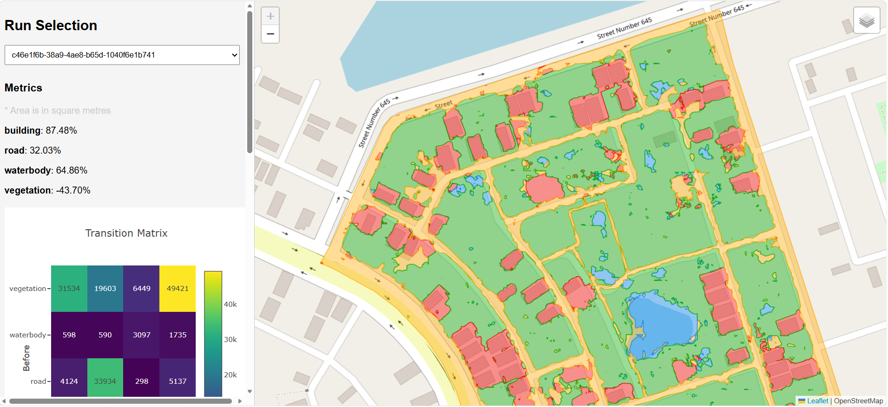

# 🛰️ LULC Change Detection



Automatically detect and quantify land-use and land-cover changes between two drone image captures using deep learning segmentation.

---

## 📋 Table of Contents

- [Overview](#overview)
- [Project Structure](#project-structure)
- [Quick Start](#quick-start)
- [Pipeline](#pipeline)
- [Outputs](#outputs)
- [Viewing Results](#viewing-results)

---

## 📌 Overview

End-to-end pipeline for detecting LULC changes in georeferenced drone imagery:

- Aligns and rectifies image pairs
- Classifies pixels into 5 classes: **building, road, waterbody, vegetation, other**
- Generates segmentation masks and vector polygons (GeoJSON)
- Computes per-class transition matrices and change statistics

---

## 🗂️ Project Structure

```
LULC_change_detection_DL/
├── main.py                      # Entry point
├── change_detection_pipeline.py # Pipeline orchestrator
├── change_metrics.py            # Change metrics computation
├── inference.py                 # Tile-based inference
├── config.py                    # Configuration & class definitions
├── utils.py                     # Helper utilities
│
├── final_model/
│   └── resunet_scripted.pt      # Pre-trained model
│
├── datasets/
│   └── raw_images/              # Place input images here
│
└── output/                      # Results (auto-created)
    ├── index.html               # Web results viewer
    ├── runs.json                # Run history
    └── RUN_ID=<uuid>/           # Per-run outputs
```

---

## 🚀 Quick Start

### 1. Install Dependencies

**CPU:**
```bash
pip install -r requirements.base.txt -r requirements.cpu.txt
```

**GPU (CUDA 11.8+):**
```bash
pip install -r requirements.base.txt -r requirements.gpu.txt
```

### 2. Place Input Images

```
datasets/raw_images/
├── Phase1.tif    # Earlier capture
└── Phase2.tif    # Later capture
```

### 3. Set Image Paths in `main.py`

```python
if __name__ == "__main__":
    image_path_1 = r'path/to/Phase1.tif'
    image_path_2 = r'path/to/Phase2.tif'

    data = main(image_path_1, image_path_2)
    print(data)
```

### 4. Run

```bash
python main.py
```

Results are saved to `output/RUN_ID=<unique-id>/`.

---

## 🔄 Pipeline

```
Image Pair (T1, T2)
       ↓
Rectification & Alignment
       ↓
Segmentation Inference
       ↓
Polygonization
       ↓
Change Detection
       ↓
Output (GeoJSON, Metrics, Rasters)
```

**Stage 1 — Alignment:** Coregisters the image pair, resamples to 10 cm resolution, reprojects to a unified CRS, and clips to identical extent.

**Stage 2 — Inference:** Runs tile-based segmentation (512×512 patches with edge padding) and outputs single-band class rasters.

**Stage 3 — Polygonization:** Vectorizes segments into GeoJSON FeatureCollections with class, area, and perimeter properties.

**Stage 4 — Change Detection:** Computes pixel-level differences, transition matrices, area changes, and change percentages per class.

---

## 📊 Outputs

Each run produces a folder `output/RUN_ID=<uuid>/`:

| File | Description |
|------|-------------|
| `processed_1.tif`, `processed_2.tif` | Rectified input images |
| `segmented_1.tif`, `segmented_2.tif` | Class prediction masks |
| `segmented_polygonized_1.geojson` | Vector polygons — time 1 |
| `segmented_polygonized_2.geojson` | Vector polygons — time 2 |
| `change_metrics.json` | Change statistics |

### `change_metrics.json` format

```json
{
  "class_mappings": {"1": "building", "2": "road"},
  "bin_count": {
    "1": {"before": 5000, "after": 7500}
  },
  "transition_matrix": {
    "1": {"1": 4500, "2": 500}
  },
  "change_percent": {"1": 50.0, "2": -6.67}
}
```

---

## 🌐 Viewing Results

**Browser viewer** — serve the output folder and open in your browser:

```bash
cd ./output
python -m http.server 8000
```

Then navigate to `http://localhost:8000/index.html`.

**GIS software** — open any `.geojson` file in:
- [QGIS](https://qgis.org) (free)
- ArcGIS Pro
- Folium (Python)